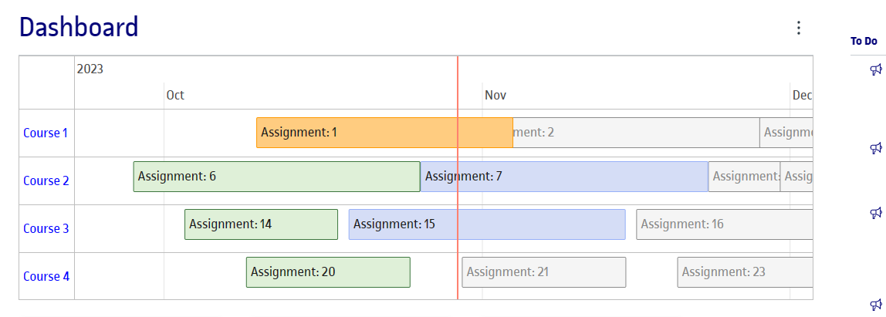
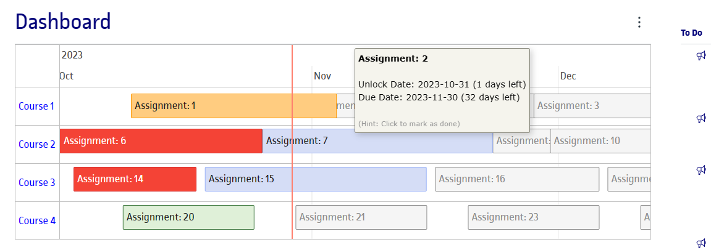

# Canvas Assignments Timeline Extension

<h1 align="center">
  <a href="https://example.com/canvas-assignments-timeline-extension"></a>
  <br>
  <a href="https://chrome.google.com/webstore/detail/canvas-assignments-timeline/ifgeabdejopdnkdojbpcjhljclchmcbn">Canvas Assignments Timeline</a> - Transform your Canvas LMS dashboard.
  <br>
  <br>
</h1>

<p align="center">
  <a href="https://github.com/a-aznar/canvas-assignments-timeline-extension/blob/main/LICENSE">
    
  </a>
  <a href="https://chrome.google.com/webstore/detail/canvas-assignments-timeli/ifgeabdejopdnkdojbpcjhljclchmcbn">
    
  </a>
  <a href="https://chrome.google.com/webstore/detail/canvas-assignments-timeli/ifgeabdejopdnkdojbpcjhljclchmcbn">
    
  </a>
  <a href="https://github.com/a-aznar/canvas-assignments-timeline-extension/graphs/contributors" alt="Contributors">
    
  </a>
</p>

<div align="center">
  [](https://chrome.google.com/webstore/detail/canvas-assignments-timeline/ifgeabdejopdnkdojbpcjhljclchmcbn)
</div>

# Manage Your Canvas Assignments Like Never Before!

<h4 align="center">Experience a Revolutionary Way to View and Manage Assignments in Canvas LMS</h4>





## Key Features of Canvas Assignments Timeline

### Interactive Timeline

- **Visual Timeline**: View all your assignments in an interactive timeline.
- **Assignment Management**: Easily manage and mark assignments as completed.
- **Details on Demand**: Hover over assignments to quickly see details.
- **Efficient Navigation**: Directly access courses and modules from the timeline.
- **Customization**: Remembers your timeline settings and preferences.
- **Multilingual Support**: Use the extension in 13 different languages.
- **User-Friendly**: No account setup required and free to use.

## Contribute

Star ⭐, Fork 🍴, and Contribute 👩‍💻! Your contributions, big or small, are always appreciated!

### Build and Run Locally

#### Install dependencies

```bash
yarn
```

#### Build the extension

```bash
yarn build
```

#### Load the extension into Chrome

1. Go to `chrome://extensions/`
2. Enable "Developer mode" at the top right.
3. Click "Load unpacked" and select the `dist` directory inside `canvas-assignments-timeline-extension`.

### Code structure

- **[Popup](https://developer.chrome.com/docs/extensions/mv3/user_interface/#popup)**: Interface's source code at root.
- **[Content Script](https://developer.chrome.com/docs/extensions/mv3/content_scripts/)**: Injects React app into Canvas. Located in `content-script` directory.

## Acknowledgements

- Inspired by [React TypeScript Chrome Extension](https://github.com/yosevu/react-content-script).
- Uses [vis-timeline for React](https://github.com/razbensimon/react-vis-timeline).
- Implements [Canvas LMS API](https://canvas.utwente.nl/doc/api/index.html) for data integration.

### Happy Coding! 🚀🖥️
